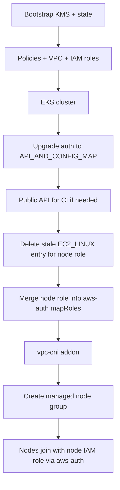

# Dev EKS troubleshooting guide

History of issues seen while bringing up **my-project / dev** (`my-project-dev-eks`) via GitHub Actions, what caused them, and where fixes live in this repo.

---

## Issues reported so far (what / why / fix)

### 1. Bootstrap / Terraform backend

**What:** Early applies failed; backend not ready.

**Why:** Remote state (S3, locks, KMS) did not exist before Terraform expected it.

**Fix:** Bootstrap first with local state, then migrate to S3; CI runs bootstrap → policies → dev in order.

---

### 2. Duplicate IAM policies

**What:** Policies already exist errors in dev.

**Why:** Dev tried to create the same policies as `global/policies`.

**Fix:** Dev reads policy ARNs from `global/policies` remote state only.

---

### 3. Duplicate IAM tags

**What:** Duplicate tag key errors.

**Why:** Mixed tag casing (`Project` vs `project`) on the same resource.

**Fix:** Consistent lowercase tag keys in dev `common_tags`.

---

### 4. IRSA `for_each`

**What:** Plan/apply failed on IRSA.

**Why:** `for_each` needed stable keys before OIDC existed.

**Fix:** Two IAM passes: cluster/node roles first, IRSA after EKS creates OIDC.

---

### 5. KMS key (node volumes / secrets)

**What:** `InvalidKMSKey.InvalidState`; nodes never became healthy.

**Why:** KMS policy allowed S3/DynamoDB only, not EKS or EC2 EBS.

**Fix:** Extend bootstrap KMS policy for EKS and EC2 volume encryption.

---

### 6. EKS cluster 409 / forced replacement

**What:** Terraform tried to recreate the cluster; AWS returned 409.

**Why:** Config drift (`access_config`, version) triggered replace on an existing cluster.

**Fix:** Omit `access_config` by default on imports; ignore cluster version drift; CI import/recovery for existing cluster.

---

### 7. Authentication mode vs access entries

**What:** `CreateAccessEntry` failed — mode must be API or API_AND_CONFIG_MAP.

**Why:** Cluster was still `CONFIG_MAP`.

**Fix:** In-place upgrade to `API_AND_CONFIG_MAP` before any access-entry or node-auth work (script + CI step).

---

### 8. Access policy on `EC2_LINUX` entry

**What:** Policy association failed.

**Why:** `AssociateAccessPolicy` only works for `STANDARD` entries, not `EC2_LINUX`.

**Fix:** Remove policy association; keep entry only (later we learned managed nodes should not rely on this path — see #12).

---

### 9. Security groups / launch template

**What:** `NodeCreationFailure` (join/network).

**Why:** Custom launch template security groups missed EKS cluster SG / control-plane traffic.

**Fix:** Explicit SG rules; later removed custom launch template so EKS wires SGs correctly.

---

### 10. `aws-auth` import / management

**What:** Conflicts with existing `aws-auth` ConfigMap.

**Why:** ConfigMap in cluster but not in state, or wrong management approach.

**Fix:** Import when needed; later moved to **merge** `mapRoles` instead of replacing the whole ConfigMap.

---

### 11. Removing Terraform `aws-auth` (“EKS auto-manage”)

**What:** After dropping managed `aws-auth`, nodes still failed with **`Unauthorized`**.

**Why:** No valid `mapRoles` when kubelet registered (especially after auth-mode changes and failed node groups).

**Fix:** Brought back explicit `aws-auth` handling — still not enough alone (see #12).

---

### 12a. No IAM instance profile on nodes (shows as Unauthorized)

**What:** Kubelet `Unauthorized`; SSM metadata shows `role=` empty; nodeadm/bootstrap may still succeed (AL2023).

**Why:** Instances launched **without an IAM instance profile** have no AWS credentials. This often happens when the node group still uses an **old custom launch template** from earlier applies (Terraform removed the LT, but AWS kept it on the node group). Kubelet then cannot authenticate regardless of `aws-auth`.

**Fix:** Delete the node group so EKS recreates it **without** a custom launch template; add explicit `aws_iam_instance_profile` on the node role for recovery; CI `reset_stale_eks_managed_nodegroup` deletes NG when a launch template is attached or instances lack a profile.

**Reference:** `modules/iam/main.tf` (instance profile); `.github/scripts/terraform-common.sh` (`reset_stale_eks_managed_nodegroup`).

---

### 12. Kubelet `Unauthorized` (main blocker)

**What:** Kubelet logs show **`Unauthorized`**; node never joins; node group `CREATE_FAILED`.

**Why:** Node IAM role not authorized the right way for **managed** nodes in **`API_AND_CONFIG_MAP`**:

- Not a network/bootstrap problem (API is reachable).
- **`EC2_LINUX` access entries** are for **self-managed** nodes, not the right primary path for managed node groups.
- Replacing the whole `aws-auth` ConfigMap via Terraform/kubernetes provider could break mappings.
- CI had to run auth steps **after** auth-mode upgrade and **before** a new node group, with a reachable API for `aws-auth` updates.

**Fix (current approach):**

- Delete **any** EKS access entry for the node role (EKS recreates one when the node group is created; API auth is tried first and can return `Unauthorized` even when `aws-auth` is correct).
- Create the node group at **scale 0**, delete the access entry, refresh `aws-auth`, then **scale out** (`after-nodegroup-auth.sh`).
- **Merge** node role into `aws-auth` `mapRoles` (validated YAML via PyYAML).
- Use **AL2023** AMI for Kubernetes 1.30.
- Enable public API in dev so GitHub Actions can update `aws-auth`.

**Reference:** `modules/eks/node_groups.tf` (scale 0 + `null_resource.node_group_scale_out`); `modules/eks/scripts/after-nodegroup-auth.sh`; `modules/eks/scripts/delete-node-access-entry.sh`.

---

### 13. Launch template / disk / state drift

**What:** Failures with stale launch template in state/AWS.

**Why:** Module moved from custom launch template to `disk_size` on the node group.

**Fix:** Remove stale launch template from state; delete failed `general` node group before re-apply.

---

### 14. CI import recovery / paths

**What:** Wrong “not in state” / bad paths during import.

**Why:** `state list` vs `state show`, relative paths, nested `pushd`.

**Fix:** Absolute dev paths, `state show` for checks, corrected import helpers.

---

### 15. `vpc-cni` before nodes

**What:** CNI / addon ordering issues.

**Why:** Nodes need vpc-cni before join; avoid duplicate install in addons module.

**Fix:** Install vpc-cni in `module.eks` before node group; disable duplicate in `module.addons`.

---

### 16. Formatting (CI)

**What:** `terraform fmt -check` failed.

**Fix:** Align HCL formatting in dev stack.

---

### 17. Workflow order / env

**What:** Dev apply without bootstrap outputs.

**Fix:** Export `TF_STATE_*` from bootstrap; apply policies before dev.

---

## One-line theme

Most problems were **platform glue** (KMS, SGs, state, auth mode). The long pole was **node identity**: the right IAM role, authorized the right way for **managed** nodes under **`API_AND_CONFIG_MAP`** — not generic “cluster down,” and not self-managed-node patterns applied to managed node groups.

---

## Intended apply flow (after fixes)

---

## What to do operationally

1. Run **Actions → Terraform → workflow_dispatch → apply** on latest `main` (target `all` or `environments/dev`).
2. In CI logs, confirm:
   - Authentication mode upgraded (or already `API_AND_CONFIG_MAP`).
   - Stale **EC2_LINUX** access entry removed (if it existed).
   - **`aws-auth` contains** the node role (`my-project-dev-eks-node`).
   - Node group `general` reaches **ACTIVE**.
3. If apply fails, read the **node join diagnostics** block: auth mode, `aws-auth mapRoles`, instance IAM profile vs expected node role, kubelet journal (SSM).

---

## Reference fixes (file + line)

Line numbers refer to current `main` and may shift as the repo evolves.

| Issue | Primary file | Lines |
|-------|----------------|-------|
| KMS | `global/bootstrap/main.tf` | 49–84 |
| Policies remote state | `environments/dev/data.tf` | 1–11 |
| Tags | `environments/dev/main.tf` | 4–7 |
| IRSA two-pass | `modules/iam/irsa.tf` | 4–18 |
| IRSA two-pass | `environments/dev/main.tf` | 49–51, 121–128 |
| Cluster 409 / import | `modules/eks/main.tf` | 32–50 |
| Cluster 409 / import | `.github/scripts/terraform-common.sh` | 97–147, 361–424 |
| Cluster import (CI step) | `.github/workflows/terraform.yml` | 254–259 |
| Auth mode upgrade | `modules/eks/scripts/upgrade-eks-authentication-mode.sh` | 22–28 |
| Auth mode upgrade | `modules/eks/auth_mode.tf` | 2–16 |
| Auth mode upgrade (CI) | `.github/workflows/terraform.yml` | 261–265 |
| EC2_LINUX policy removed | `modules/eks/access.tf` | 1–10 |
| SG rules | `modules/eks/cluster_security_group_rules.tf` | 6–31 |
| Node group (no LT, disk) | `modules/eks/node_groups.tf` | 1–51 |
| **Unauthorized / aws-auth** | `modules/eks/scripts/apply-aws-auth-node-role.sh` | 1–48 |
| **Unauthorized / aws-auth** | `modules/eks/aws_auth.tf` | 1–24 |
| **Unauthorized / aws-auth** | `modules/eks/variables.tf` | 117–131 |
| Public API (dev) | `environments/dev/main.tf` | 93–96 |
| AL2023 AMI default | `environments/dev/variables.tf` | 80 |
| CI prepare / diagnostics | `.github/scripts/terraform-common.sh` | 476–757 |
| Dev apply + diagnostics | `.github/workflows/terraform.yml` | 276–286 |
| Stale state cleanup | `.github/scripts/terraform-common.sh` | 525–540 |
| vpc-cni before nodes | `modules/eks/bootstrap_addons.tf` | 1–13 |
| vpc-cni (addons off) | `environments/dev/main.tf` | 141–142 |
| Bootstrap init | `.github/scripts/terraform-common.sh` | 284–304 |
| Workflow order | `.github/workflows/terraform.yml` | 31–38, 234–240, 196–218 |
| CI fmt | `.github/workflows/terraform.yml` | 56–70 |

---

## Issue 16: CoreDNS / EBS CSI add-ons DEGRADED (20m timeout)

**Symptoms**

- `waiting for EKS Add-On ... create: timeout ... last state: 'DEGRADED'`
- Terraform warning: re-apply will **remove and recreate** add-on configuration
- Kubelet still logs `Unauthorized` on the node

**Cause**

1. **Root cause:** managed nodes never reach **Ready**, so system add-on pods cannot schedule; AWS reports add-ons as **DEGRADED**.
2. **Apply order:** `module.addons` ran even when node join failed; Terraform only waited for the node group **ACTIVE**, not **Ready**.
3. **Replace warning:** add-ons already existed in the cluster but were not in Terraform state (no import).

**Fix (in repo)**

| Change | File |
|--------|------|
| Post-scale access-entry delete + `aws-auth` refresh + wait for Ready nodes | `modules/eks/scripts/wait-for-ready-nodes.sh` |
| Fallback: migrate `API_AND_CONFIG_MAP` → **API** + **EC2_LINUX** access entry | `modules/eks/scripts/migrate-cluster-auth-to-api.sh` |
| Fail node group step before add-ons if join fails | `modules/eks/scripts/after-nodegroup-auth.sh` |
| Gate add-ons on `module.eks.nodes_joined` | `modules/eks/outputs.tf`, `modules/addons/nodes_ready.tf`, `environments/dev/main.tf` |
| Install order: kube-proxy → coredns / ebs-csi; 45m timeouts | `modules/addons/main.tf`, `coredns.tf` |
| Import existing add-ons in CI | `.github/scripts/terraform-common.sh` |

**After fix:** push and re-run the dev **apply** workflow. Add-ons should install only after at least one node is **Ready**.

---

## Issue 17: Perfect aws-auth but still Unauthorized (API_AND_CONFIG_MAP)

**Symptoms (your latest diagnostics)**

- `authMode`: `API_AND_CONFIG_MAP`
- No access entry for node role
- `aws-auth` `mapRoles` correct for `my-project-dev-eks-node`
- Node group ACTIVE, `launchTemplate: null`, IAM profile present, IMDS role correct
- Kubelet still `Unable to register node with API server: Unauthorized` for 1+ hour

**Cause**

In `API_AND_CONFIG_MAP`, the **API authentication path is evaluated before** the `aws-auth` ConfigMap. When no valid access entry exists for the node principal, the API path can return **Unauthorized without falling through to `aws-auth`**, even when `mapRoles` is correct.

**Fix**

| Step | What |
|------|------|
| 1 | CI migrates dev cluster `API_AND_CONFIG_MAP` → **API** (`migrate-cluster-auth-to-api.sh`) |
| 2 | Create **EC2_LINUX** access entry for the node IAM role (not STANDARD) |
| 3 | **Recycle** existing node instances (`recycle-nodegroup-instances.sh`) so kubelets re-auth |
| 4 | `create_node_access_entry = true` in `environments/dev/main.tf` |

Prepare order: `upgrade_eks_authentication_mode_if_needed` → `migrate_dev_cluster_to_api_node_auth` → apply.

---

## Symptom → first place to look

| Symptom | First reference |
|--------|------------------|
| KMS / volume errors | `global/bootstrap/main.tf` L49–84 |
| Cluster 409 / replace | `modules/eks/main.tf` L32–50 |
| Access entry mode error | `upgrade-eks-authentication-mode.sh` L22–28 |
| Policy on EC2_LINUX entry | `modules/eks/access.tf` L1–10 |
| Join / SG (not Unauthorized) | `cluster_security_group_rules.tf` L6–31 |
| **Kubelet Unauthorized** | `after-nodegroup-auth.sh`, `wait-for-ready-nodes.sh`, `migrate-cluster-auth-to-api.sh` |
| Add-ons DEGRADED (no Ready nodes) | `modules/addons/*`, `environments/dev/main.tf` `nodes_ready_dependency` |
| Add-on replace/purge warning | `.github/scripts/terraform-common.sh` `import_existing_dev_resources` |
| Stale failed node group | `terraform-common.sh` L476–522 |
