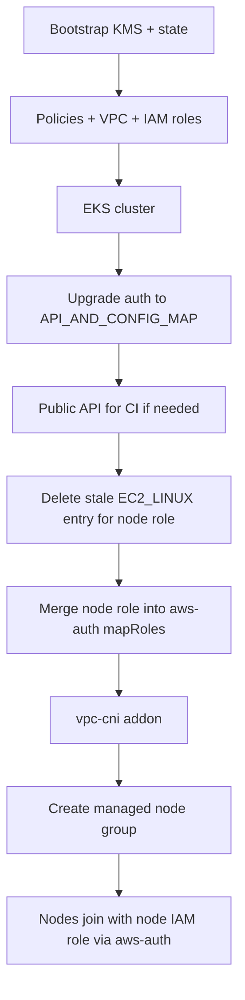

# Dev EKS troubleshooting guide

History of issues seen while bringing up **my-project / dev** (`my-project-dev-eks`) via GitHub Actions, what caused them, and where fixes live in this repo.

---

## Issues reported so far (what / why / fix)

### 1. Bootstrap / Terraform backend

**What:** Early applies failed; backend not ready, or CI failed during `bootstrap_init` / import on a **partial** bootstrap (some AWS resources exist, others do not).

**Why:** Remote state (S3, locks, KMS) did not exist before Terraform expected it, **or** a previous run left orphaned resources (S3 bucket without DynamoDB, KMS keys without alias, bucket settings not applied).

**Fix:** Bootstrap first; CI runs bootstrap → policies → dev in order. For partial bootstrap, use recovery import + apply (see **1a–1g** below). After first successful apply, save GitHub repo variables: `TF_STATE_BUCKET`, `TF_STATE_KMS_KEY_ID`, `TF_STATE_DYNAMODB_TABLE`, `TF_STATE_KMS_KEY_ARN`.

**Expected resource names (my-project / dev):**

| Resource | Name |
|----------|------|
| S3 state bucket | `my-project-dev-terraform-state-<account_id>` |
| DynamoDB lock table | `my-project-dev-terraform-locks` |
| KMS alias | `alias/my-project-dev-terraform-state` |

---

#### 1a. `NotFoundException`: KMS alias not found on `bootstrap_init`

**Symptoms**

```
aws kms describe-key --key-id alias/my-project-dev-terraform-state
NotFoundException: Alias ... is not found
```

**Cause**

`bootstrap_init` saw the **state S3 bucket** (`head-bucket` succeeded) and assumed bootstrap was complete. It called `aws kms describe-key` on the alias, but the alias was never created (partial apply, manual bucket, or KMS keys exist without alias).

**Fix (in repo)**

- Require **both** bucket **and** KMS alias before treating remote backend as ready (`bootstrap_remote_backend_ready`).
- If bucket exists but alias does not, init partial S3 backend instead of failing on `describe-key`.

**Reference:** `.github/scripts/terraform-common.sh` — `bootstrap_remote_backend_ready`, `bootstrap_set_backend_for_existing_bucket`, `bootstrap_init` (~L259–L535).

---

#### 1b. `Backend initialization required` on `terraform import`

**Symptoms**

```
Error: Backend initialization required, please run "terraform init"
Reason: Initial configuration of the requested backend "s3"
```

Occurs on `import_existing_bootstrap_resources` after `terraform init -backend=false`.

**Cause**

Terraform **1.7+** requires a configured S3 backend for `import` / `plan` / `apply` when `backend "s3"` is declared in `backend.tf`. Local-only init (`-backend=false`) is not enough once the state bucket already exists in AWS.

**Fix (in repo)**

- When the state bucket exists, run `terraform init -reconfigure` with S3 `-backend-config=...` (discover KMS from alias or bucket default encryption).
- Do **not** pass deprecated `-state=terraform.tfstate` on import/plan/apply.

**Reference:** `global/bootstrap/backend.tf`; `.github/scripts/terraform-common.sh` — `bootstrap_init`, `import_existing_bootstrap_resources` (~L507–L607).

---

#### 1c. `Error acquiring the state lock` — DynamoDB table not found

**Symptoms**

```
ResourceNotFoundException: Requested resource not found
Unable to retrieve item from DynamoDB table "my-project-dev-terraform-locks"
```

**Cause**

S3 backend was initialized with `dynamodb_table=...` before the lock table existed (partial bootstrap: bucket yes, DynamoDB no).

**Fix (in repo)**

- Omit `dynamodb_table` from backend config until `bootstrap_dynamodb_table_exists` is true.
- After bootstrap apply creates the table, run `bootstrap_enable_state_locking` to re-init with locking enabled.

**Reference:** `.github/scripts/terraform-common.sh` — `tf_backend_config_args`, `bootstrap_enable_state_locking`; `.github/workflows/terraform.yml` — Bootstrap apply step (~L195–L204).

---

#### 1d. `Too many command line arguments` on `terraform init`

**Symptoms**

```
Warning: State bucket exists without SSE-KMS; ...
Error: Too many command line arguments. Did you mean to use -chdir?
```

**Cause**

Informational `echo` lines in `tf_backend_config_args` / `bootstrap_set_backend_for_existing_bucket` went to **stdout**. `mapfile` captured them as extra Terraform CLI arguments.

**Fix (in repo)**

- Send bootstrap status messages to **stderr** (`>&2`), not stdout.

**Reference:** `.github/scripts/terraform-common.sh` — `tf_backend_config_args`, `bootstrap_set_backend_for_existing_bucket` (~L204–L360).

---

#### 1e. S3 sub-resource import failure (public access block, versioning, encryption)

**Symptoms**

- Bucket import succeeds.
- Import fails on `aws_s3_bucket_public_access_block.terraform_state` (or versioning / encryption) with “resource does not exist”.

**Cause**

The bucket was created manually or by a partial apply **without** public access block, versioning, or SSE-KMS. Terraform cannot import resources that do not exist in AWS.

**Fix (in repo)**

- Before import, check AWS with `get-public-access-block`, `get-bucket-versioning`, `get-bucket-encryption`.
- Skip import for missing sub-resources; **apply** creates them.

**Reference:** `.github/scripts/terraform-common.sh` — `bootstrap_s3_bucket_*_exists`, `import_existing_bootstrap_resources` (~L316–L600).

---

#### 1f. KMS keys exist but alias is missing

**Symptoms**

- Warning: state bucket exists; KMS alias missing (or bucket has no SSE-KMS).
- One or more KMS keys in the account (sometimes re-enabled after pending deletion) **without** `alias/my-project-dev-terraform-state`.

**Cause**

KMS **key** and KMS **alias** are separate. Bootstrap is not complete until the alias exists and (ideally) bucket encryption, DynamoDB, and bucket hardening are in place.

**What CI does**

| Condition | Behavior |
|-----------|----------|
| Alias exists | Import key + alias; use alias for backend KMS |
| No alias, bucket uses SSE-KMS | Import key from bucket encryption; apply creates alias |
| No alias, bucket not SSE-KMS | Skip KMS import; apply creates new key + alias + bucket settings |

**Optional manual step:** In KMS console, attach alias `my-project-dev-terraform-state` to the correct existing key, then re-run bootstrap apply.

**Reference:** `global/bootstrap/main.tf` — `aws_kms_key`, `aws_kms_alias`; `.github/scripts/terraform-common.sh` — `bootstrap_kms_key_id_from_state_bucket`.

---

#### 1g. Partial bootstrap — operational recovery

**Typical partial state:** S3 bucket yes; DynamoDB no; KMS alias no; bucket settings incomplete.

**Steps**

1. Run **Actions → Terraform → apply → `global/bootstrap`** on latest `main`.
2. Confirm in logs: S3 backend init (no DynamoDB lock until table exists) → import bucket only → apply creates missing resources → `bootstrap_enable_state_locking`.
3. Save printed `TF_STATE_*` repo variables.
4. Run **policies**, then **dev**.

**Verify in AWS (same account/region as CI):**

```bash
aws s3api head-bucket --bucket my-project-dev-terraform-state-<account_id>
aws dynamodb describe-table --table-name my-project-dev-terraform-locks
aws kms describe-key --key-id alias/my-project-dev-terraform-state
aws s3api get-public-access-block --bucket my-project-dev-terraform-state-<account_id>
```

**Reference:** `global/bootstrap/README.md` — “Recovering from partial bootstrap applies”.

---

### 2. Duplicate IAM policies

**What:** Policies already exist errors in dev.

**Why:** Dev tried to create the same policies as `global/policies`.

**Fix:** Dev reads policy ARNs from `global/policies` remote state only.

---

### 3. Duplicate IAM tags

**What:** Duplicate tag key errors.

**Why:** Mixed tag casing (`Project` vs `project`) on the same resource.

**Fix:** Consistent lowercase tag keys in dev `common_tags`.

---

### 4. IRSA `for_each`

**What:** Plan/apply failed on IRSA.

**Why:** `for_each` needed stable keys before OIDC existed.

**Fix:** Two IAM passes: cluster/node roles first, IRSA after EKS creates OIDC.

---

### 5. KMS key (node volumes / secrets)

**What:** `InvalidKMSKey.InvalidState`; nodes never became healthy.

**Why:** KMS policy allowed S3/DynamoDB only, not EKS or EC2 EBS.

**Fix:** Extend bootstrap KMS policy for EKS and EC2 volume encryption.

---

### 6. EKS cluster 409 / forced replacement

**What:** Terraform tried to recreate the cluster; AWS returned 409.

**Why:** Config drift (`access_config`, version) triggered replace on an existing cluster.

**Fix:** Omit `access_config` by default on imports; ignore cluster version drift; CI import/recovery for existing cluster.

---

### 7. Authentication mode vs access entries

**What:** `CreateAccessEntry` failed — mode must be API or API_AND_CONFIG_MAP.

**Why:** Cluster was still `CONFIG_MAP`.

**Fix:** In-place upgrade to `API_AND_CONFIG_MAP` before any access-entry or node-auth work (script + CI step).

---

### 8. Access policy on `EC2_LINUX` entry

**What:** Policy association failed.

**Why:** `AssociateAccessPolicy` only works for `STANDARD` entries, not `EC2_LINUX`.

**Fix:** Remove policy association; keep entry only (later we learned managed nodes should not rely on this path — see #12).

---

### 9. Security groups / launch template

**What:** `NodeCreationFailure` (join/network).

**Why:** Custom launch template security groups missed EKS cluster SG / control-plane traffic.

**Fix:** Explicit SG rules; later removed custom launch template so EKS wires SGs correctly.

---

### 10. `aws-auth` import / management

**What:** Conflicts with existing `aws-auth` ConfigMap.

**Why:** ConfigMap in cluster but not in state, or wrong management approach.

**Fix:** Import when needed; later moved to **merge** `mapRoles` instead of replacing the whole ConfigMap.

---

### 11. Removing Terraform `aws-auth` (“EKS auto-manage”)

**What:** After dropping managed `aws-auth`, nodes still failed with **`Unauthorized`**.

**Why:** No valid `mapRoles` when kubelet registered (especially after auth-mode changes and failed node groups).

**Fix:** Brought back explicit `aws-auth` handling — still not enough alone (see #12).

---

### 12a. No IAM instance profile on nodes (shows as Unauthorized)

**What:** Kubelet `Unauthorized`; SSM metadata shows `role=` empty; nodeadm/bootstrap may still succeed (AL2023).

**Why:** Instances launched **without an IAM instance profile** have no AWS credentials. This often happens when the node group still uses an **old custom launch template** from earlier applies (Terraform removed the LT, but AWS kept it on the node group). Kubelet then cannot authenticate regardless of `aws-auth`.

**Fix:** Delete the node group so EKS recreates it **without** a custom launch template; add explicit `aws_iam_instance_profile` on the node role for recovery; CI `reset_stale_eks_managed_nodegroup` deletes NG when a launch template is attached or instances lack a profile.

**Reference:** `modules/iam/main.tf` (instance profile); `.github/scripts/terraform-common.sh` (`reset_stale_eks_managed_nodegroup`).

---

### 12. Kubelet `Unauthorized` (main blocker)

**What:** Kubelet logs show **`Unauthorized`**; node never joins; node group `CREATE_FAILED`.

**Why:** Node IAM role not authorized the right way for **managed** nodes in **`API_AND_CONFIG_MAP`**:

- Not a network/bootstrap problem (API is reachable).
- **`EC2_LINUX` access entries** are for **self-managed** nodes, not the right primary path for managed node groups.
- Replacing the whole `aws-auth` ConfigMap via Terraform/kubernetes provider could break mappings.
- CI had to run auth steps **after** auth-mode upgrade and **before** a new node group, with a reachable API for `aws-auth` updates.

**Fix (current approach):**

- Delete **any** EKS access entry for the node role (EKS recreates one when the node group is created; API auth is tried first and can return `Unauthorized` even when `aws-auth` is correct).
- Create the node group at **scale 0**, delete the access entry, refresh `aws-auth`, then **scale out** (`after-nodegroup-auth.sh`).
- **Merge** node role into `aws-auth` `mapRoles` (validated YAML via PyYAML).
- Use **AL2023** AMI for Kubernetes 1.30.
- Enable public API in dev so GitHub Actions can update `aws-auth`.

**Reference:** `modules/eks/node_groups.tf` (scale 0 + `null_resource.node_group_scale_out`); `modules/eks/scripts/after-nodegroup-auth.sh`; `modules/eks/scripts/delete-node-access-entry.sh`.

---

### 13. Launch template / disk / state drift

**What:** Failures with stale launch template in state/AWS.

**Why:** Module moved from custom launch template to `disk_size` on the node group.

**Fix:** Remove stale launch template from state; delete failed `general` node group before re-apply.

---

### 14. CI import recovery / paths

**What:** Wrong “not in state” / bad paths during import.

**Why:** `state list` vs `state show`, relative paths, nested `pushd`.

**Fix:** Absolute dev paths, `state show` for checks, corrected import helpers.

---

### 15. `vpc-cni` before nodes

**What:** CNI / addon ordering issues.

**Why:** Nodes need vpc-cni before join; avoid duplicate install in addons module.

**Fix:** Install vpc-cni in `module.eks` before node group; disable duplicate in `module.addons`.

---

### 16. Formatting (CI)

**What:** `terraform fmt -check` failed.

**Fix:** Align HCL formatting in dev stack.

---

### 17. Workflow order / env

**What:** Dev apply without bootstrap outputs.

**Fix:** Export `TF_STATE_*` from bootstrap; apply policies before dev.

---

## One-line theme

Most problems were **platform glue** (KMS, SGs, state, auth mode). The long pole was **node identity**: the right IAM role, authorized the right way for **managed** nodes under **`API_AND_CONFIG_MAP`** — not generic “cluster down,” and not self-managed-node patterns applied to managed node groups.

---

## Intended apply flow (after fixes)



---

## What to do operationally

1. Run **Actions → Terraform → workflow_dispatch → apply** on latest `main` (target `all` or `environments/dev`).
2. In CI logs, confirm:
   - Authentication mode upgraded (or already `API_AND_CONFIG_MAP`).
   - Stale **EC2_LINUX** access entry removed (if it existed).
   - **`aws-auth` contains** the node role (`my-project-dev-eks-node`).
   - Node group `general` reaches **ACTIVE**.
3. If apply fails, read the **node join diagnostics** block: auth mode, `aws-auth mapRoles`, instance IAM profile vs expected node role, kubelet journal (SSM).

---

## Reference fixes (file + line)

Line numbers refer to current `main` and may shift as the repo evolves.

| Issue | Primary file | Lines |
|-------|----------------|-------|
| KMS | `global/bootstrap/main.tf` | 49–84 |
| Policies remote state | `environments/dev/data.tf` | 1–11 |
| Tags | `environments/dev/main.tf` | 4–7 |
| IRSA two-pass | `modules/iam/irsa.tf` | 4–18 |
| IRSA two-pass | `environments/dev/main.tf` | 49–51, 121–128 |
| Cluster 409 / import | `modules/eks/main.tf` | 32–50 |
| Cluster 409 / import | `.github/scripts/terraform-common.sh` | 97–147, 361–424 |
| Cluster import (CI step) | `.github/workflows/terraform.yml` | 254–259 |
| Auth mode upgrade | `modules/eks/scripts/upgrade-eks-authentication-mode.sh` | 22–28 |
| Auth mode upgrade | `modules/eks/auth_mode.tf` | 2–16 |
| Auth mode upgrade (CI) | `.github/workflows/terraform.yml` | 261–265 |
| EC2_LINUX policy removed | `modules/eks/access.tf` | 1–10 |
| SG rules | `modules/eks/cluster_security_group_rules.tf` | 6–31 |
| Node group (no LT, disk) | `modules/eks/node_groups.tf` | 1–51 |
| **Unauthorized / aws-auth** | `modules/eks/scripts/apply-aws-auth-node-role.sh` | 1–48 |
| **Unauthorized / aws-auth** | `modules/eks/aws_auth.tf` | 1–24 |
| **Unauthorized / aws-auth** | `modules/eks/variables.tf` | 117–131 |
| Public API (dev) | `environments/dev/main.tf` | 93–96 |
| AL2023 AMI default | `environments/dev/variables.tf` | 80 |
| CI prepare / diagnostics | `.github/scripts/terraform-common.sh` | 476–757 |
| Dev apply + diagnostics | `.github/workflows/terraform.yml` | 276–286 |
| Stale state cleanup | `.github/scripts/terraform-common.sh` | 525–540 |
| vpc-cni before nodes | `modules/eks/bootstrap_addons.tf` | 1–13 |
| vpc-cni (addons off) | `environments/dev/main.tf` | 141–142 |
| Bootstrap init / partial recovery | `.github/scripts/terraform-common.sh` | 204–607 |
| Bootstrap CI workflow | `.github/workflows/terraform.yml` | 174–220 |
| Workflow order | `.github/workflows/terraform.yml` | 31–38, 221–240, 195–218 |
| CI fmt | `.github/workflows/terraform.yml` | 56–70 |

---

## Issue 16: CoreDNS / EBS CSI add-ons DEGRADED (20m timeout)

**Symptoms**

- `waiting for EKS Add-On ... create: timeout ... last state: 'DEGRADED'`
- Terraform warning: re-apply will **remove and recreate** add-on configuration
- Kubelet still logs `Unauthorized` on the node

**Cause**

1. **Root cause:** managed nodes never reach **Ready**, so system add-on pods cannot schedule; AWS reports add-ons as **DEGRADED**.
2. **Apply order:** `module.addons` ran even when node join failed; Terraform only waited for the node group **ACTIVE**, not **Ready**.
3. **Replace warning:** add-ons already existed in the cluster but were not in Terraform state (no import).

**Fix (in repo)**

| Change | File |
|--------|------|
| Post-scale access-entry delete + `aws-auth` refresh + wait for Ready nodes | `modules/eks/scripts/wait-for-ready-nodes.sh` |
| Fallback: migrate `API_AND_CONFIG_MAP` → **API** + **EC2_LINUX** access entry | `modules/eks/scripts/migrate-cluster-auth-to-api.sh` |
| Fail node group step before add-ons if join fails | `modules/eks/scripts/after-nodegroup-auth.sh` |
| Gate add-ons on `module.eks.nodes_joined` | `modules/eks/outputs.tf`, `modules/addons/nodes_ready.tf`, `environments/dev/main.tf` |
| Install order: kube-proxy → coredns / ebs-csi; 45m timeouts | `modules/addons/main.tf`, `coredns.tf` |
| Import existing add-ons in CI | `.github/scripts/terraform-common.sh` |

**After fix:** push and re-run the dev **apply** workflow. Add-ons should install only after at least one node is **Ready**.

---

## Issue 17: Perfect aws-auth but still Unauthorized (API_AND_CONFIG_MAP)

**Symptoms (your latest diagnostics)**

- `authMode`: `API_AND_CONFIG_MAP`
- No access entry for node role
- `aws-auth` `mapRoles` correct for `my-project-dev-eks-node`
- Node group ACTIVE, `launchTemplate: null`, IAM profile present, IMDS role correct
- Kubelet still `Unable to register node with API server: Unauthorized` for 1+ hour

**Cause**

In `API_AND_CONFIG_MAP`, the **API authentication path is evaluated before** the `aws-auth` ConfigMap. When no valid access entry exists for the node principal, the API path can return **Unauthorized without falling through to `aws-auth`**, even when `mapRoles` is correct.

**Fix**

| Step | What |
|------|------|
| 1 | CI migrates dev cluster `API_AND_CONFIG_MAP` → **API** (`migrate-cluster-auth-to-api.sh`) |
| 2 | Create **EC2_LINUX** access entry for the node IAM role (not STANDARD) |
| 3 | **Recycle** existing node instances (`recycle-nodegroup-instances.sh`) so kubelets re-auth |
| 4 | `create_node_access_entry = true` in `environments/dev/main.tf` |

Prepare order: `upgrade_eks_authentication_mode_if_needed` → `migrate_dev_cluster_to_api_node_auth` → apply.

---

## Issue 18: API mode + EC2_LINUX entry but still Unauthorized

**Symptoms**

- `authMode`: `API`, EC2_LINUX access entry present
- `kubernetesGroups` may show only `system:nodes` (missing `system:bootstrappers` on describe)
- `CreateAccessEntry` 409 in Terraform (entry created by CI script, not imported)
- Kubelet still `Unauthorized`

**Cause**

EC2_LINUX access entries also need **`AmazonEKSNodegroupPolicy`** associated (`aws eks associate-access-policy`). Without it, the API authorizer rejects kubelet registration even when the entry exists.

**Fix**

| Change | File |
|--------|------|
| `aws_eks_access_policy_association` for `AmazonEKSNodegroupPolicy` | `modules/eks/access.tf` |
| CI associates policy + imports entry/policy into state | `ensure-node-access-policy.sh`, `import_eks_node_access_to_state` |
| Node group waits for entry + policy before create | `modules/eks/node_groups.tf` |

---

## Symptom → first place to look

| Symptom | First reference |
|--------|------------------|
| KMS alias NotFound on bootstrap init | §1a — `bootstrap_remote_backend_ready` |
| Backend init required on import | §1b — `bootstrap_init` + S3 `-backend-config` |
| DynamoDB lock table not found | §1c — `tf_backend_config_args`, `bootstrap_enable_state_locking` |
| Too many CLI arguments on init | §1d — stderr for bootstrap log lines |
| S3 public access block import fail | §1e — `bootstrap_s3_bucket_*_exists` |
| KMS keys but no alias | §1f — partial bootstrap / apply creates alias |
| Partial bootstrap (bucket only) | §1g — recovery steps + `global/bootstrap/README.md` |
| KMS / volume errors (EKS nodes) | `global/bootstrap/main.tf` L49–84 |
| Cluster 409 / replace | `modules/eks/main.tf` L32–50 |
| Access entry mode error | `upgrade-eks-authentication-mode.sh` L22–28 |
| Policy on EC2_LINUX entry | `modules/eks/access.tf` L1–10 |
| Join / SG (not Unauthorized) | `cluster_security_group_rules.tf` L6–31 |
| **Kubelet Unauthorized** | `after-nodegroup-auth.sh`, `wait-for-ready-nodes.sh`, `migrate-cluster-auth-to-api.sh` |
| Add-ons DEGRADED (no Ready nodes) | `modules/addons/*`, `environments/dev/main.tf` `nodes_ready_dependency` |
| Add-on replace/purge warning | `.github/scripts/terraform-common.sh` `import_existing_dev_resources` |
| Stale failed node group | `terraform-common.sh` L476–522 |
