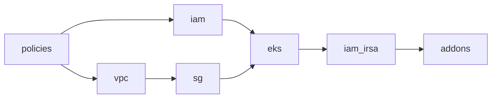

# Dev environment

Root module for the **dev** EKS platform. It wires shared IAM policies, networking, IAM roles, security groups, the EKS cluster, IRSA roles, and cluster add-ons. No AWS resources are defined here directly—only module calls, variables, outputs, and backend configuration.

## Prerequisites

1. **AWS credentials** with permission to create VPC, EKS, IAM, and related resources in the target account and region.
2. **Terraform** `~> 1.7` (see repository `.terraform-version`).
3. **`global/bootstrap` applied first** in the same account and environment (`dev`). Bootstrap creates the S3 state bucket, DynamoDB lock table, and KMS key used by this stack and documents the output values you must copy into `backend.tf` and `terraform.tfvars`.

4. Apply **`global/policies`** once per account/environment before dev. Dev reads policy ARNs from `global/policies/terraform.tfstate` via `terraform_remote_state` (it does not create policies itself).

## Configure remote state (`backend.tf`)

Terraform **cannot** interpolate variables or module outputs inside a `backend` block. `backend.tf` only pins `key` and `encrypt`; pass the rest at init time.

### Local init (after bootstrap)

```bash
cd global/bootstrap && terraform output -json   # note bucket, kms_key_id, dynamodb_table_name, kms_key_arn

cd environments/dev
terraform init \
  -backend-config="bucket=<state_bucket_name>" \
  -backend-config="key=dev/terraform.tfstate" \
  -backend-config="region=us-east-1" \
  -backend-config="kms_key_id=<kms_key_id>" \
  -backend-config="dynamodb_table=<dynamodb_table_name>" \
  -backend-config="encrypt=true"
```

Set `state_kms_key_arn` in `terraform.tfvars` from bootstrap output `kms_key_arn` for EKS encryption.

### GitHub Actions

The [Terraform workflow](../../.github/workflows/terraform.yml) runs **Actions → Terraform → Run workflow** with **operation** `plan` or `apply` and **target** `all` (bootstrap → policies → dev). After the first bootstrap apply, add repository variables from outputs so plan-only runs work without re-applying bootstrap:

| Variable | Bootstrap output |
|----------|------------------|
| `TF_STATE_BUCKET` | `state_bucket_name` |
| `TF_STATE_KMS_KEY_ID` | `kms_key_id` |
| `TF_STATE_DYNAMODB_TABLE` | `dynamodb_table_name` |
| `TF_STATE_KMS_KEY_ARN` | `kms_key_arn` |

## Apply order

Resources are created through child modules in dependency order:



1. **policies** — shared IAM managed policies  
2. **vpc** — VPC, subnets, single NAT gateway (`single_nat_gateway = true` for dev cost)  
3. **iam** (first pass) — cluster and node IAM roles only (no OIDC / IRSA)  
4. **sg** — control plane, node, and related security groups  
5. **eks** — control plane (and optionally node groups)  
6. **iam_irsa** (second pass) — IRSA roles for `vpc-cni` and `ebs-csi`  
7. **addons** — kube-proxy, CoreDNS, EBS CSI driver  

### Phased apply (foundation + four EKS passes)

**Foundation** (default): all `enable_eks_*` flags `false` and `enable_eks = false` → VPC, IAM roles, security groups only.

Then enable EKS in **four cumulative passes** (each pass keeps prior flags `true`):

| Pass | Variables | Creates |
|------|-----------|---------|
| **1 — cluster** | `enable_eks_cluster = true` | EKS cluster, OIDC, CloudWatch logs, vpc-cni add-on |
| **2 — nodes** | + `enable_eks_nodes = true` | Managed node group, access entry, aws-auth wiring |
| **3 — IRSA** | + `enable_irsa = true` | IRSA roles for vpc-cni and ebs-csi |
| **4 — add-ons** | + `enable_addons = true` | kube-proxy → CoreDNS + EBS CSI driver (see order below) |

**Add-on install order** (also printed in CI as `=== EKS add-on lifecycle order ===`):

1. **vpc-cni** — cluster phase (`module.eks`), before nodes  
2. **kube-proxy** — addons phase (`module.addons`), after nodes Ready  
3. **coredns** + **aws-ebs-csi-driver** — parallel after kube-proxy (EBS CSI needs IRSA from phase 3)

Destroy order for `module.addons` only is reverse: coredns + ebs-csi → kube-proxy. vpc-cni stays in `module.eks` until cluster destroy.

Shortcut: `enable_eks = true` enables all four phases in one apply.

**GitHub Actions:** **target** `environments/dev` (or `all`), set **dev_eks_phase** to `none` → `cluster` → `nodes` → `irsa` → `addons` (or `all` once). Each choice turns on the cumulative flags automatically.

**Apply is additive:** re-running a lower phase (e.g. `nodes` to roll the node group) does **not** destroy IRSA or add-ons already in Terraform state. Destroy still respects the selected phase (use `addons-only` to remove add-ons only).

**Destroy add-ons only (keep cluster, nodes, VPC):** use **dev_eks_phase: `addons-only`** + **operation: destroy**. Do **not** use `addons` for destroy — that removes the entire dev stack including VPC.

| Operation | dev_eks_phase | Effect |
|-----------|---------------|--------|
| apply | `nodes` | Node group only; keeps IRSA/add-ons if already deployed |
| apply | `addons` or `addons-only` | Create IRSA + add-ons |
| destroy | **`addons-only`** | Remove add-ons only (`enable_addons=false` apply) |
| destroy | `addons` | **Full dev stack destroy** (cluster, nodes, VPC, …) |

From this directory:

```bash
terraform init
terraform plan -var-file=terraform.tfvars
terraform apply -var-file=terraform.tfvars
```

Use a private `terraform.tfvars` (see `.gitignore`) for account-specific values; the committed example uses a placeholder account ID.

## Adding staging or production

Copy this folder to `environments/staging` or `environments/prod` and adjust:

| Item | Dev | Staging / prod |
|------|-----|----------------|
| `backend.tf` `key` | `dev/terraform.tfstate` | `staging/terraform.tfstate` or `prod/terraform.tfstate` |
| `environment` / tags | `dev` | `staging` or `prod` |
| `single_nat_gateway` | `true` (cost) | often `false` for HA |
| `endpoint_public_access` | `false` | org policy |
| CIDRs, node sizes, `node_groups` | smaller defaults | scale per environment |

Re-run bootstrap per account/environment if state infrastructure is isolated per env.

## Inputs

| Name | Type | Default | Description |
|------|------|---------|-------------|
| `project_name` | `string` | — | Project name for naming and tags |
| `environment` | `string` | `dev` | Environment label |
| `region` | `string` | `us-east-1` | AWS region |
| `aws_account_id` | `string` | — | 12-digit AWS account ID |
| `cluster_version` | `string` | `1.29` | EKS Kubernetes version |
| `vpc_cidr` | `string` | `10.0.0.0/16` | VPC CIDR |
| `azs` | `list(string)` | `us-east-1a`, `us-east-1b` | Availability zones |
| `private_subnet_cidrs` | `list(string)` | `10.0.1.0/24`, `10.0.2.0/24` | Private subnet CIDRs |
| `public_subnet_cidrs` | `list(string)` | `10.0.101.0/24`, `10.0.102.0/24` | Public subnet CIDRs |
| `node_groups` | `map(object)` | one `general` `t3.medium` group | EKS managed node groups |
| `irsa_roles` | `map(object)` | `vpc-cni`, `ebs-csi` | IRSA roles (second IAM pass); EBS CSI policy ARN wired from policies module |
| `tags` | `map(string)` | `managed_by`, `owner` | Extra tags (merged with `project`, `environment`) |
| `state_bucket_name` | `string` | `""` | Bootstrap bucket (document only; set `backend.tf` manually) |
| `state_kms_key_id` | `string` | `""` | Bootstrap KMS key ID (document only; set `backend.tf` manually) |
| `dynamodb_table_name` | `string` | `""` | Bootstrap lock table (document only; set `backend.tf` manually) |
| `state_kms_key_arn` | `string` | — | Bootstrap KMS key ARN for EKS encryption |

## Outputs

| Name | Description |
|------|-------------|
| `vpc_id` | VPC ID |
| `private_subnet_ids` | Private subnet IDs for workloads |
| `cluster_name` | EKS cluster name |
| `cluster_endpoint` | Kubernetes API endpoint (private) |
| `cluster_version` | Control plane Kubernetes version |
| `cluster_oidc_issuer_url` | OIDC issuer URL |
| `oidc_provider_arn` | IAM OIDC provider ARN |
| `node_group_ids` | Map of node group name to ID |
| `irsa_role_arns` | Map of IRSA role key to ARN |
| `addon_arns` | Map of add-on name to ARN |
| `kms_key_arn` | Bootstrap KMS key ARN (reference) |
